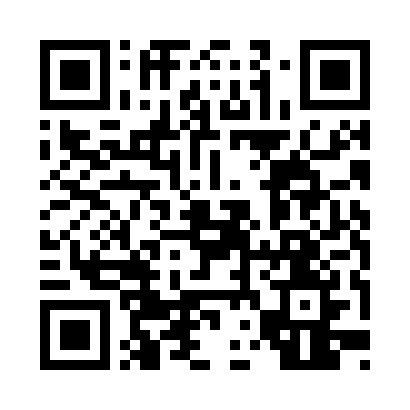
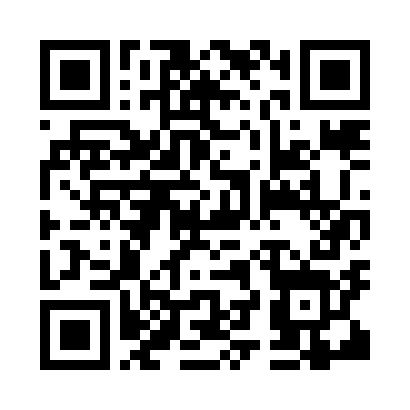
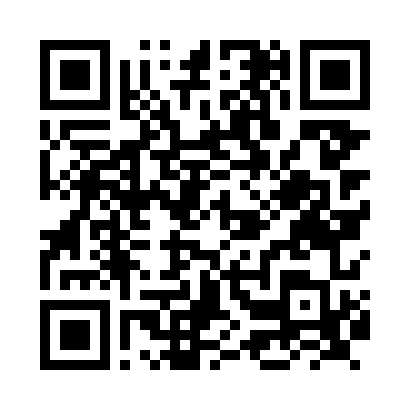

# camarero-digital

Este el mi proyecto final para el CFGS de desarrollo de aplicaciones web

La app es una evolución del sistema habitual que muchos restaurantes han adoptado tras la pandemia, en donde puedes acceder a una carta en pdf escaneando un código QR.

Está diseñada bajo el enfoque "Mobile-first", pero la experiencia de usuario es excelente en Desktop igualmente.

## Acceso a la app
Puedes acceder a la app a través de los códigos QR: 
(Ten en cuenta que está desplegada en un servidor gratuíto que se encuentra inactivo hasta que recibe alguna petición, por lo que la primera carga puede demorar un poco)

### Códigos qr

Mesa 1

Mesa 2

Mesa 3

